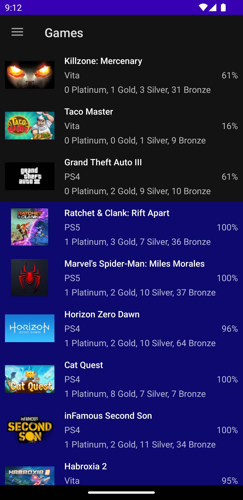
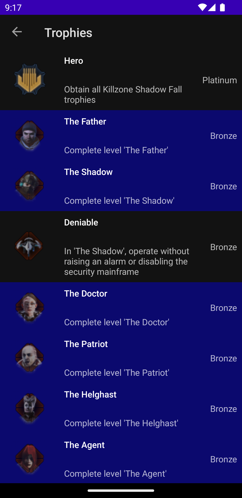
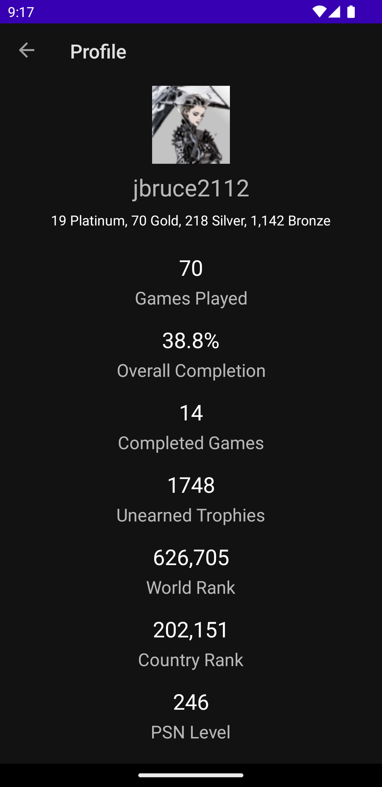

# PSN Profile Viewer

PSN Profile Viewer is an Android app for viewing Playstation user progress from [PSNProfiles](https://www.psnprofiles.com). It allows you to quickly view trophy stats for the last 100 played games, as well as overall stats for your PSN ID. You can view information for any PSN ID which is linked with PSNProfiles.com.

Data is fetched by scraping HTML using [jsoup](https://github.com/jhy/jsoup) and is persisted on disk for offline availability.

<table border="0">
  <tr>
    <td></td>
    <td></td>
    <td></td>
  </tr>
</table>

## License
The code is licensed under the MIT license.
